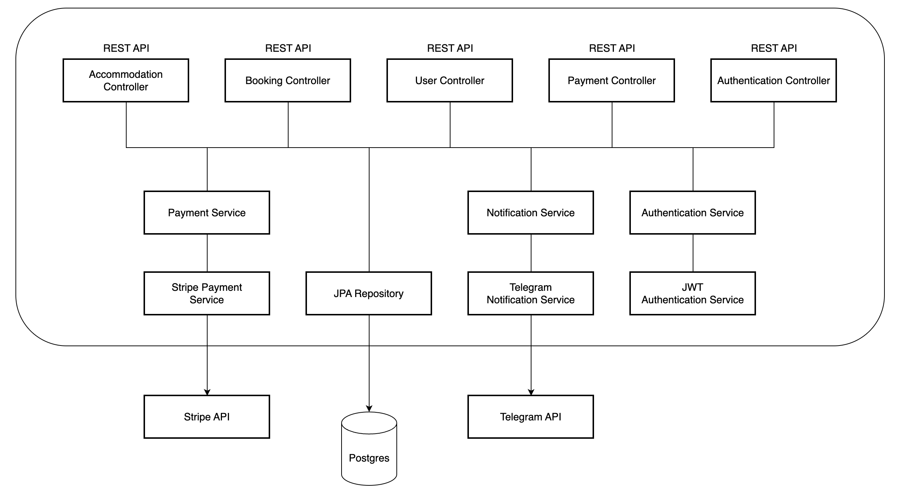

[](LICENSE)
# rent:Me
___
Booking service, offering individuals the opportunity to rent homes,
apartments, and other accommodations for their chosen duration.
The application provides convenient way for managing properties, 
renters, financial transactions, and booking records.

This system will not only simplify the tasks of service administrators 
but also provide renters with a seamless and efficient platform for 
securing accommodations, transforming the way people 
experience housing rentals.

### Technologies & tools
___
* Java 17
* Spring Boot 3.3.5
* Spring Security 3.3.5
* Spring Data JPA 3.3.5
* Docker 27.5.1
* JWT 0.12.5
* Junit 5.10.5
* Liquibase 4.27.0
* Lombok 0.2.0
* Mapstruct 1.5.5
* Postgres 42.7.4
* Swagger 2.6.0
* Telegram Api 6.9.7.1
* Stripe Api 28.0.0

### Architecture
___


### Domain models
___

<details>
  <summary>Accommodation</summary>

- **ID**: Long (Unique identifier for each accommodation)
- **Type**: Enum (e.g., HOUSE, APARTMENT, CONDO, VACATION_HOME)
- **Location**: Address (Address or location of the accommodation)
- **Size**: String (e.g., Studio, 1 Bedroom, 2 Bedroom, etc.)
- **Amenities**: Array of Strings (List of amenities available)
- **Daily Rate**: BigDecimal (Price per day in $USD)
- **Availability**: Integer (Number of available units of this accommodation)

</details>

<details>
  <summary>User (Customer)</summary>

- **ID**: Long (Unique identifier for each user)
- **Email**: String
- **First Name**: String
- **Last Name**: String
- **Password**: String (Stored securely)
- **Role**: Enum (e.g., MANAGER (or ADMIN), CUSTOMER)

</details>

<details>
  <summary>Booking</summary>

- **ID**: Long (Unique identifier for each booking)
- **Check-in Date**: LocalDate
- **Check-out Date**: LocalDate
- **Accommodation ID**: Long (Reference to the booked accommodation)
- **User ID**: Long (Reference to the booking user)
- **Status**: Enum (e.g., PENDING, CONFIRMED, CANCELED, EXPIRED)

</details>

<details>
  <summary>Payment</summary>

- **ID**: Long (Unique identifier for each payment)
- **Status**: Enum (e.g., PENDING, PAID)
- **Booking ID**: Long (Reference to the booking associated with the payment)
- **Session URL**: URL (URL for the payment session with a payment provider)
- **Session ID**: String (ID of the payment session)
- **Amount to Pay**: BigDecimal (Total payment amount in $USD)

</details>

### Features
___

#### 1. Authentication Controller:
- **POST:** /register - Allows users to register a new account.
- **POST:** /login - Grants JWT tokens to authenticated users.

#### 2. User Controller: Managing authentication and user registration
- **PUT:** /users/{id}/role - Enables users to update their roles, providing role-based access.
- **GET:** /users/me - Retrieves the profile information for the currently logged-in user.
- **PUT/PATCH:** /users/me - Allows users to update their profile information.

#### 3. Accommodation Controller: Managing accommodation inventory (CRUD for Accommodations)
- **POST:** /accommodations - Permits the addition of new accommodations.
- **GET:** /accommodations - Provides a list of available accommodations.
- **GET:** /accommodations/{id} - Retrieves detailed information about a specific accommodation.
- **PUT/PATCH:** /accommodations/{id} - Allows updates to accommodation details, including inventory management.
- **DELETE:** /accommodations/{id} - Enables the removal of accommodations.

#### 4. Booking Controller: Managing users' bookings
- **POST:** /bookings - Permits the creation of new accommodation bookings.
- **GET:** /bookings/?user_id=...&status=... - Retrieves bookings based on user ID and their status. (Available for managers)
- **GET:** /bookings/my - Retrieves user bookings
- **GET:** /bookings/{id} - Provides information about a specific booking.
- **PUT/PATCH:** /bookings/{id} - Allows users to update their booking details.
- **DELETE:** /bookings/{id} - Enables the cancellation of bookings.

#### 5. Payment Controller (Stripe): Facilitates payments for bookings through the platform. Interacts with Stripe API. Use stripe-java library.

- **GET:** /payments/?user_id=... - Retrieves payment information for users.
- **POST:** /payments/ - Initiates payment sessions for booking transactions.
- **GET:** /payments/success/ - Handles successful payment processing through Stripe redirection.
- **GET:** /payments/cancel/ - Manages payment cancellation and returns payment paused messages during Stripe redirection.

#### 6. Notifications Service (Telegram):

- Notifications about new bookings created/canceled, new created/released accommodations, and successful payments
- Other services interact with it to send notifications to booking service administrators.
- Uses Telegram API, Telegram Chats, and Bots.

### How to run app
___
#### Requirements
* Git
* Maven
* Java 17+
* Docker

#### Set up
1. Clone the project from the GitHub:

   ```$ git clone https://github.com/furthernull/booking-app```

2. Go to root directory with project:

   ```$ cd booking-app```

3. Create and fulfill `.env` file in the root folder with project:

   ###### example of .env file
   ```
    POSTGRES_USER=your_db_user
    POSTGRES_PASSWORD=you_db_password
    POSTGRES_DATABASE=you_db_name
    POSTGRES_LOCAL_PORT=5434
    POSTGRES_DOCKER_PORT=5432
    SPRING_LOCAL_PORT=8088
    SPRING_DOCKER_PORT=8080
    DEBUG_PORT=5005
    JWT_EXPIRATION=jwt_expiration
    JWT_SECRET=jwt_secret
    TELEGRAM_BOT_TOKEN=telegram_bot_token
    TELEGRAM_BOT_USERNAME=telegram_bot_username
   ```
4. Build the project you can run the command:

   ```$ mvn clean package```

5. Build the image, run docker command:

   ```$ docker-compose build```

6. Run container:

   ```$ docker-compose up```

### Testing
___
Run test, execute the command:

```$ mvn test```

### Contributing
___
Pull requests are welcome. For major changes, please open an issue first
to discuss what you would like to change.

Please make sure to update tests as appropriate.
___
###### **Author:** Dmytro Sokolovskyi [LinkedIn](https://www.linkedin.com/in/dmytro-sokolovskyi-93069b268/) | [GitHub](https://github.com/furthernull)
###### **License:** The Booking app is released under the terms of the [MIT License](LICENSE)
